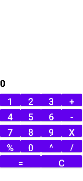

# Calculator App
This App is for calculate a div of numbers, multiple of numbers, sum of numbers, subtract of number or you can calculate with all of those variants with the number you are choice. I build this app using java programming language and design the UI with XML. btw this app is'nt responsive because it's exclusive for Pixel 4. feel free to feedback this app.

# Screen
